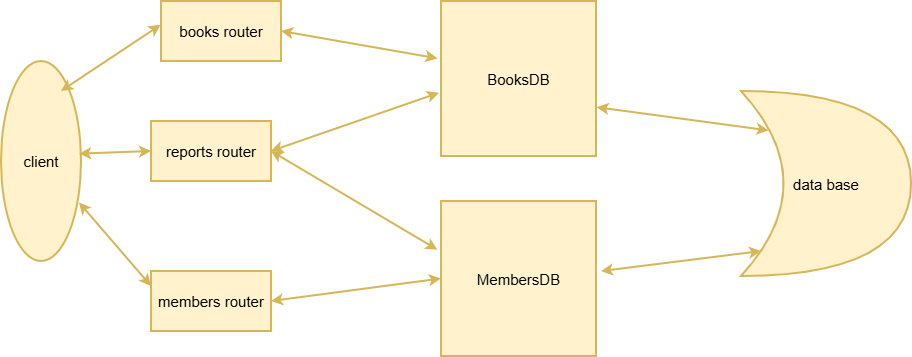

# Library Management System 

The system is written in Python, is powered by a fastapi server and accepts HTTP requests only.
The system uses several tables in the database to store data.
The system includes logs to document actions taken.

## The folder structure:
    library-api/
    │
    │
    ├── main.py
    ├── database/
    │   ├── db_connection.py
    │   ├── book_db.py
    │   └── member_db.py
    ├── routes/
    │   ├── book_routes.py
    │   ├── member_routes.py
    │   └── report_routes.py
    ├── logs/
    │   ├── app.log
    |   └── config.py
    │
    ├── README.md
    ├── requirements.txt
    └── .gitignore

## Table structure
### books
- id - Filled in by the system
- title - Not empty, Maximum 50 characters
- author - Not empty, Maximum 50 characters
- genre - Not empty, One of the following entries:  Fiction | Non-Fiction | Science | History | Other
- is_available - Not empty.
- borrowed_by_member_id.

### members
- id - Filled in by the system
- name - Not empty, Maximum 50 characters
- email - Not empty, unique.
- is_active - Not empty
- total_borrows - Not empty

## System rules:
- To create a book - send genre, author and title
- To create a member - send name and email
- An inactive member cannot borrow books, only return them
- There is no option to lend a book that has already been borrowed
- A member cannot borrow more than 3 books at the same time
- A member cannot return a book that he does not have

## endpoints

### books
|Method	| Endpoint	| description
| :--: | :-- | :-- |	
| POST | /books	| create a book	
| GET | /books	| get all books	
| GET | /books/{id}	| get a book by ID	
| PUT | /books/{id}	| update a book	
| PATCH | /books/{id}/borrow/{member_id}	| borrow a book	
| PATCH | /books/{id}/return/{member_id}	| return a book	

### members
|Method	| Endpoint	| description
| :--: | :-- | :-- |	
| POST | /members	| create a member	
| GET | /members	| get all members	
| GET | /members/{id}	| get a member by ID	
| PUT | /members/{id}	| update a member	
| PATCH | /members/{id}/deactivate	| deactivate a member	
| PATCH | /members/{id}/activate	| activate a member

### reports
|Method	| Endpoint	| description
| :--: | :-- | :-- |	
| GET | /reports/summary	| get general summary	
| GET | /reports/books-by-genre | get summary of books by genre	
| GET | /reports/top-member | get the most activate member	

## system flow

## To use the system:    
You must install the requirements.txt file.

At the first time set up Docker using the command "docker run --name mysql-lm -p 3306:3306 -e MYSQL_ROOT_PASSWORD=root -e MYSQL_DATABASE=library_db -d mysql:8"

For next times use "docker run mysql-lm" command instead.

Then run the server using the command "uvicorn main:app".